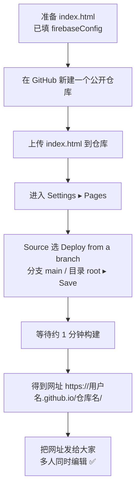

# 把「婚礼座位图」发布到 GitHub Pages —— 图文一步步清单

本指南教你把 `婚礼座位图.html` 发布成一个**人人可打开的网址**（例如 `https://你的用户名.github.io/wedding/`）。
配合已经做好的 Firebase 实时同步，发布后大家打开同一个链接就能**同时编辑、互相实时看到改动**。

> 说明：下面的「界面位置示意框」是**示意图**（用文字框标出按钮大概在页面的哪个位置），不是真实截图，照着找按钮即可。

---

## 0. 开始前的准备

你需要：

- 一个 **GitHub 账号**（没有就去 https://github.com 免费注册）。
- 已经填好 `firebaseConfig` 的 `婚礼座位图.html`（没填也能发布，只是会停在「本机模式」，多人不同步）。

### ⭐ 强烈建议：先把文件改名为 `index.html`

GitHub Pages 会把 `index.html` 当作首页，这样访客直接打开网址根目录就能看到座位图，**链接最干净**。

- 原文件名：`婚礼座位图.html`（中文名会让网址变成一长串 `%E5%A9%9A...` 编码，很难发给别人）
- 改成：`index.html`

> 改名不影响内容，双击照样能本地打开。

---

## 1. 整体流程一眼看懂



---

## 2. 方式一：纯网页操作（推荐，零基础）

全程在浏览器里点鼠标，不需要装任何软件。

### 步骤 ①：新建仓库（Repository）

登录 GitHub 后，点右上角的 **`+`** ▸ **New repository**。

```
┌──────────────────────────── GitHub 顶部导航栏 ──────────────────────────┐
│  Search...                                          [ + ▾ ]   [头像 ▾]   │
│                                                       │                  │
│                                                       ▼                  │
│                                                  ┌──────────────┐        │
│                                                  │ New repository│ ◀── 点这个
│                                                  │ Import ...    │        │
│                                                  └──────────────┘        │
└─────────────────────────────────────────────────────────────────────────┘
```

在新建页面填写：

```
┌──────────────── Create a new repository ────────────────┐
│ Repository name *   [ wedding              ]   ◀ 随便起名 │
│ Description         [ 婚礼座位图（可留空）  ]              │
│                                                          │
│  (●) Public     ◀── 必须选 Public，Pages 免费版需公开     │
│  ( ) Private                                             │
│                                                          │
│  [ ] Add a README file   ◀ 可勾可不勾                     │
│                                                          │
│                       [ Create repository ]  ◀ 点击创建   │
└──────────────────────────────────────────────────────────┘
```

> 名字示例用了 `wedding`，最终网址就是 `https://你的用户名.github.io/wedding/`。

### 步骤 ②：上传 `index.html`

进入刚建好的仓库，点 **Add file ▸ Upload files**。

```
┌──────────────── 仓库主页 ────────────────┐
│  Code   Issues   Pull requests   ...      │
│                                           │
│   [ Add file ▾ ]   [ <> Code ▾ ]          │
│        │                                  │
│        ▼                                  │
│   ┌─────────────────┐                     │
│   │ Create new file │                     │
│   │ Upload files    │ ◀── 点这个           │
│   └─────────────────┘                     │
└───────────────────────────────────────────┘
```

把 `index.html` **拖进**上传区（或点 choose your files 选择），然后拉到页面底部点绿色按钮 **Commit changes**。

```
┌──────────── Upload files ────────────┐
│   ┌─────────────────────────────┐    │
│   │  把 index.html 拖到这里       │    │
│   │  Drag files here ...         │    │
│   └─────────────────────────────┘    │
│                                       │
│   Commit changes                      │
│   [ Add index.html              ]     │
│                       [ Commit changes ] ◀ 点击提交
└───────────────────────────────────────┘
```

### 步骤 ③：开启 GitHub Pages

进入仓库顶部的 **Settings**（⚙️），左侧菜单点 **Pages**。

```
┌── 仓库 Settings 左侧菜单 ──┐      ┌─────── GitHub Pages 设置区 ───────┐
│  General                  │      │  Build and deployment             │
│  Collaborators            │      │                                   │
│  ...                      │      │  Source                           │
│  Code and automation      │      │  [ Deploy from a branch ▾ ] ◀ 选这个│
│   ├ Branches              │      │                                   │
│   ├ ...                   │      │  Branch                           │
│   └ Pages   ◀── 点这个     │      │  [ main ▾ ]   [ / (root) ▾ ]  [Save]│
└───────────────────────────┘      │                          ▲        │
                                    │                    选 main + root │
                                    │                    然后点 Save     │
                                    └───────────────────────────────────┘
```

- **Source**：选 `Deploy from a branch`
- **Branch**：选 `main`，目录选 `/ (root)`
- 点 **Save**

### 步骤 ④：拿到网址

保存后，停留或刷新 Pages 页面，顶部会出现一条绿色提示：

```
┌───────────────────────────────────────────────────────────┐
│ ✅ Your site is live at                                     │
│    https://你的用户名.github.io/wedding/      [ Visit site ] │
└───────────────────────────────────────────────────────────┘
```

> 首次发布通常约 **1 分钟内**生效；如果点开是 404，等一会儿再刷新即可。
> 拿到这个网址后，发给所有人，大家打开就能**同时查看和编辑**。

---

## 3. 方式二：用 Git 命令行发布（可选，给熟悉 Git 的人）

> 已经会用 Git 才需要看这段；不会的话用上面的方式一即可。

```bash
# 1. 在本地新建文件夹并放入 index.html（即改名后的婚礼座位图）
mkdir wedding && cd wedding
cp /路径/婚礼座位图.html ./index.html

# 2. 初始化并提交
git init
git add index.html
git commit -m "publish wedding seating chart"

# 3. 关联到你在 GitHub 上新建的空仓库（先在网页建好 wedding 仓库）
git branch -M main
git remote add origin https://github.com/你的用户名/wedding.git
git push -u origin main
```

推送后，同样去 **Settings ▸ Pages**，按方式一的步骤③开启即可。

---

## 4. 以后想修改怎么办（更新页面）

座位的「人名增删」会自动存到云端，**不需要重新发布**。
只有当你想改**网页本身**（标题、颜色、桌子布局等）时，才需要更新文件：

- **网页操作**：进仓库 ▸ 点开 `index.html` ▸ 右上角铅笔 ✏️ 编辑 ▸ `Commit changes`；或重新 `Upload files` 覆盖。
- **命令行**：改好本地文件后 `git add . && git commit -m "update" && git push`。

提交后 GitHub Pages 会自动重新构建，约 1 分钟生效（可能需要强制刷新浏览器 `Ctrl/Cmd + Shift + R` 清缓存）。

---

## 5. 常见问题（FAQ）

| 现象 | 原因 / 解决 |
|---|---|
| 打开网址显示 **404** | ① 刚发布还没构建完，等 1 分钟刷新；② 文件名不是 `index.html`，则网址要加文件名，如 `.../wedding/婚礼座位图.html`（中文会被编码）；③ 确认 Pages 的 Branch 选的是有文件的分支。 |
| 页面顶部显示 **「本机模式」** 而不是绿色「已连接」 | `firebaseConfig` 没填或填错。回到 `index.html` 顶部把 6 个字段都填上真实值，重新提交。 |
| 多人打开**看不到彼此修改** | 同上，多人同步必须先配好 Firebase；另外确认 Firestore 安全规则允许读写（见下）。 |
| 改了文件**网页没变** | 浏览器缓存。强制刷新 `Ctrl/Cmd + Shift + R`，或等 GitHub Pages 构建完成。 |
| 中文文件名链接很丑 | 把文件改名为 `index.html`，网址就变成干净的仓库根地址。 |
| 仓库必须公开吗？ | GitHub 免费版的 Pages 需要仓库 **Public**。座位图不含敏感信息，公开即可。 |

### Firestore 安全规则（配 Firebase 时设置）

在 Firebase 控制台 ▸ Firestore Database ▸ Rules，粘贴（婚礼内部用，知道链接即可读写）：

```
rules_version = '2';
service cloud.firestore {
  match /databases/{database}/documents {
    match /{document=**} { allow read, write: if true; }
  }
}
```

> 注意：这条规则是「公开可写」——任何拿到链接的人都能改。婚礼内部使用没问题；若担心被陌生人乱改，可后续加更严格的规则或简单口令校验。

---

## 6. 一句话总结

> 改名 `index.html` → GitHub 建公开仓库 → 上传 → Settings ▸ Pages 选 `main / root` 保存 → 拿到 `https://用户名.github.io/仓库名/` 链接发给大家。
